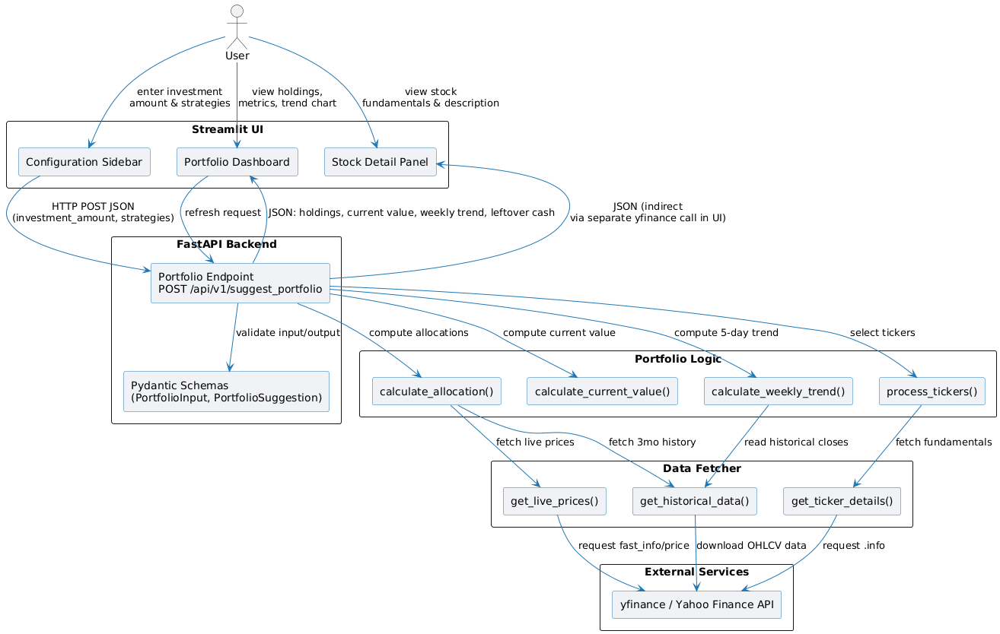
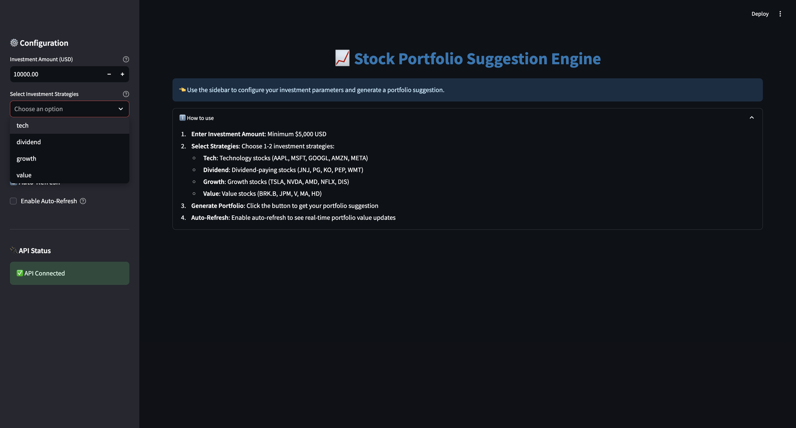
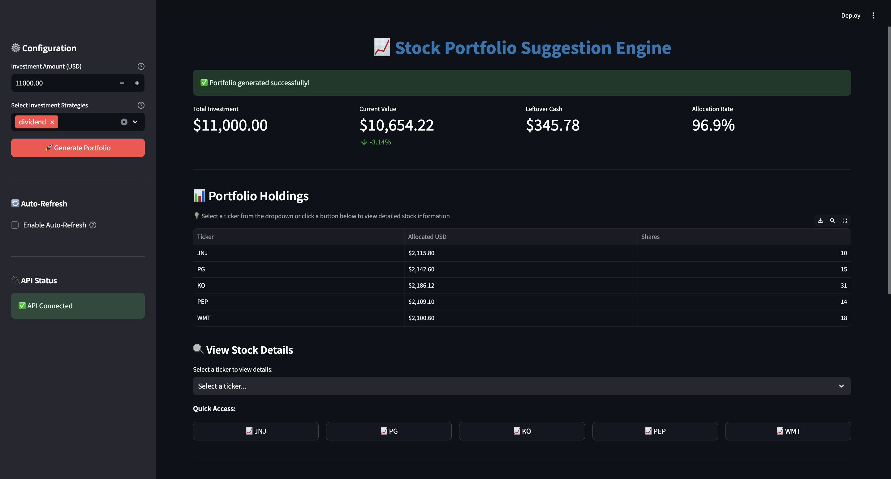
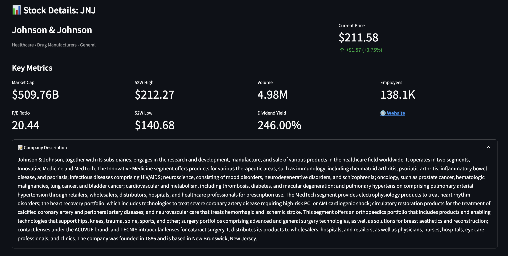

# Stock Portfolio Suggestion Engine

A FastAPI backend with Streamlit UI for generating stock portfolio suggestions based on investment strategies.




## Features

- **FastAPI Backend**: RESTful API for portfolio calculations
- **Streamlit UI**: Beautiful, interactive web interface with real-time updates
- **Multiple Strategies**: Ethical, Growth, Quality, Value, and Index investment strategies
- **Smart Allocation**: Momentum-based weighting algorithm that allocates more funds to better-performing assets
- **Real-time Data**: Fetches live stock prices using yfinance
- **Auto-refresh**: Automatically updates portfolio values at configurable intervals
- **Interactive Charts**: Plotly charts showing portfolio value trends

## Project Structure

```
stock-portfolio-suggestion/
├── stock_portfolio_api/          # FastAPI backend
│   ├── main.py                   # API endpoints
│   ├── constants.py              # Strategy definitions
│   ├── schemas.py                # Pydantic models
│   ├── data_fetcher.py           # yfinance integration
│   ├── portfolio_logic.py        # Financial calculations
│   └── requirements.txt          # Backend dependencies
├── ui/                           # Streamlit frontend
│   ├── app.py                    # Main UI application
│   └── requirements.txt          # UI dependencies
└── README.md                     # This file
```

## Installation

### Quick Start (Recommended)

The easiest way to set up and run the application is using the provided run script:

1. Navigate to the project directory:
```bash
cd stock-portfolio-suggestion
```

2. Make the script executable (first time only):
```bash
chmod +x run-script.sh
```

3. Run the script:
```bash
./run-script.sh
```

The script will:
- Create a Python virtual environment (if it doesn't exist)
- Install all backend and frontend dependencies
- Start both the FastAPI backend and Streamlit frontend

The services will be available at:
- **Backend API**: `http://localhost:8000`
- **API Documentation**: `http://localhost:8000/docs`
- **Frontend UI**: `http://localhost:8501`

Press `Ctrl+C` to stop all services.

### Manual Installation

If you prefer to set up manually:

#### Backend Setup

1. Create and activate a virtual environment:
```bash
python3 -m venv venv
source venv/bin/activate  # On Windows: venv\Scripts\activate
```

2. Install backend dependencies:
```bash
pip install -r stock_portfolio_api/requirements.txt
```

#### UI Setup

1. Install UI dependencies:
```bash
pip install -r ui/requirements.txt
```

## Running the Application

### Using the Run Script (Recommended)

Simply run:
```bash
./run-script.sh
```

### Manual Start

#### Step 1: Start the FastAPI Backend

In one terminal window:
```bash
uvicorn stock_portfolio_api.main:app --reload
```

The API will be available at `http://localhost:8000`
- API Documentation: `http://localhost:8000/docs`
- Health Check: `http://localhost:8000/health`

#### Step 2: Start the Streamlit UI

In another terminal window:
```bash
streamlit run ui/app.py
```

The UI will automatically open in your browser at `http://localhost:8501`

## Usage

### Using the Streamlit UI

1. **Configure Investment**:
   - Enter investment amount (minimum $5,000)
   - Select 1-2 investment strategies:
     - **Ethical Investing**: ESG-focused (Excludes Energy, Utilities, Basic Materials)
     - **Growth Investing**: High-growth companies (Revenue Growth > 15%)
     - **Quality Investing**: Financially robust (ROE > 15%, Debt/Equity < 50%)
     - **Value Investing**: Undervalued companies (P/E Ratio < 25)
     - **Index Investing**: Market ETFs (VOO, QQQ, VTI, SPY)

2. **Generate Portfolio**: Click "Generate Portfolio" button



3. **View Results**:
   - Summary metrics (Total Investment, Current Value, Leftover Cash)
   - Portfolio holdings table (showing unequal weights based on performance)
   - Interactive portfolio value trend chart




4. **Auto-Refresh**: Enable auto-refresh to see real-time portfolio value updates


### Using the API Directly

**Endpoint**: `POST /api/v1/suggest_portfolio`

**Request Body**:
```json
{
  "investment_amount": 10000,
  "strategies": ["Ethical Investing", "Growth Investing"]
}
```

**Response**:
```json
{
  "suggested_holdings": [
    {
      "ticker": "AAPL",
      "allocated_usd": 1250.0,
      "shares_purchased": 7
    }
  ],
  "current_total_value_usd": 10150.0,
  "weekly_value_trend": [
    {
      "date": "2024-01-15",
      "portfolio_value_usd": 10000.0
    }
  ],
  "leftover_cash_usd": 25.0
}
```

## Investment Strategies

The engine intelligently selects stocks based on specific financial criteria:

- **Ethical Investing**: Filters for ESG-friendly sectors, strictly excluding Energy, Utilities, and Basic Materials.
- **Growth Investing**: Targets high-potential companies with >15% annual revenue growth.
- **Quality Investing**: Selects financially robust companies with high Return on Equity (>15%) and low Debt-to-Equity (<50%).
- **Value Investing**: Targets undervalued companies with a P/E ratio < 25.
- **Index Investing**: Allocates to a fixed basket of broad-market ETFs (VOO, QQQ, VTI, etc.) for stability.

### 🧠 Smart Allocation Logic

Unlike traditional portfolios that split funds equally, this engine uses a **Momentum-Based Allocation** algorithm:

- **Trend Analysis**: The system fetches 3 months of historical price data for every selected stock.
- **Scoring**: It calculates a performance score by comparing the **Current Live Price** against the **20-Day Moving Average**.
- **Weighted Allocation**:
  - **Strong Uptrend**: Stocks trading above their average get a significantly higher % of the investment (score is squared to amplify rewards).
  - **Weak Trend**: Stocks trading below their average receive a reduced allocation to minimize risk.

## Requirements

### Backend
- Python 3.8+
- fastapi
- uvicorn[standard]
- yfinance
- pandas
- numpy<2.0
- pydantic

### UI
- streamlit
- requests
- plotly
- pandas

## Notes

- The API uses yfinance to fetch real-time stock data
- Portfolio allocation uses a smart momentum algorithm (not equal distribution). Stronger stocks get more capital.
- Shares are calculated using floor division (no fractional shares)
- Historical data fetches the last 3 months of data to calculate reliable moving average trends.
- Auto-refresh interval is configurable (default: 30 seconds)

## Troubleshooting

**API Connection Error**: Make sure the FastAPI backend is running on port 8000

**NumPy Compatibility**: If you encounter NumPy 2.x compatibility issues, ensure numpy<2.0 is installed

**Port Already in Use**: Change the port using:
- Backend: `uvicorn stock_portfolio_api.main:app --port 8001`
- UI: `streamlit run ui/app.py --server.port 8502`
